# 简介

本教程是面向刚接触 NEO 的 C# 开发者的快速入门，如需进行更全面的学习可参考 [官方技术文档](http://docs.neo.org/zh-cn/index.html)。

## 你将会学到什么

本文将以在 NEO 区块链上发布一个 NEP-5 资产为例，一步步带领开发者完成开发环境的搭建和配置，编写智能合约以及在私链上部署和调用合约。

- 搭建本地网络 （链接）
- 开发与部署 NEP-5 合约（链接）

## 你需要准备什么

NEO 有两个全节点客户端：NEO-GUI 和 NEO-CLI。本教程将使用 NEO-CLI 搭建私链供节点连接，使用 NEO-GUI 发布智能合约，关于客户端的详细信息，可参考 [NEO 节点介绍](https://docs.neo.org/zh-cn/node/introduction.html)。

### 系统环境

NEO-GUI 支持以下环境：

Windows 7 SP1 / Windows 8 / Windows 10

Windows 10 之前版本的系统需要安装 [.NET Framework 4.7.1](https://www.microsoft.com/net/download/framework)

NEO-CLI 支持以下环境：

- Linux (ubuntu 16.04 及以上)
- Windows 10

> [!NOTE]
>
> 由于同时涉及到 NEO-GUI 和 NEO-CLI ，建议直接使用 Windows 10 的系统。
>
> 本教程中的描述均发生于 Windows 10 系统上，由于部分环境和依赖项的配置在不同系统上都有差异，如读者使用其他系统，请参考 [技术文档](http://docs.neo.org/zh-cn/index.html) 中对应章节。

### 下载客户端

- NEO-GUI

  进入 [GitHub](https://github.com/neo-project/neo-gui/releases) 下载最新的Release版本，直接运行 neo-gui.exe 即可。

- NEO-CLI

  以 Windows 10为例：

  客户端无需安装，进入[GitHub](https://github.com/neo-project/neo-cli/releases)下载最新的Release版本。  

  从 [GitHub](https://github.com/neo-project/neo-cli.git) 下载源代码或通过以下命令下载：

  ```
  $ git clone https://github.com/neo-project/neo-cli.git
  ```

### 创建钱包文件

我们需要创建 4 个钱包文件，后文搭建私链时将会用到。钱包用来存储 NEO 账户及账户中的资产信息，使用 NEO-GUI 或 NEO-CLI 都可以创建。下文以 NEO-GUI 为例创建 4个钱包：分别命名为1、2、3、4，.json 格式。

1. 在 NEO-GUI 中点击 `钱包` -> `创建钱包数据库`。根据屏幕提示进行创建。
2. 钱包创建成功后，右键点击标准账户中的地址，选择 `查看私钥`，可以查看该账户信息（地址、公钥、私钥）。
3. 复制该地址公钥，以备后用。


创建好4个钱包并且保存好公钥后，关闭 NEO-GUI，进入下一步——搭建开发环境。

# 搭建本地网络

在本节我们将完成以下任务：

- 搭建私链
- 将节点接入私链
- 提取创世区块中的 NEO 和 GAS
- 创建一个钱包文件

## 搭建私链

NEO 官方提供了供用户开发、调试和测试的测试网（Test Net），但在本地搭建你自己的私链将获得更多的灵活性以及取之不尽的测试币。这里介绍一种搭建私链的简易方法，想要学习标准方法可参考[搭建私有链](http://docs.neo.org/zh-cn/network/private-chain/private-chain.html)。

### 安装节点

NEO 私有链的部署需要至少 4 个节点才能取得共识，所以这里我们将之前安装好的 neo-cli 文件夹复制为 4 份，文件夹名分别命名为 node1、node2、node3、node4。

### 添加插件

要使节点达成共识，需要安装 SimplePolicy 插件启用共识策略。特别注意的是，插件的版本号需与客户端保持一致。 

1. 下载 [Plugins](https://github.com/neo-project/neo-plugins/releases)中的SimplePolicy并解压。
2. 将文件夹 Plugins 拷贝四份，分别放置到 4 个节点文件夹中。

### 放置钱包文件

将前面使用 NEO-GUI 创建的 4 个钱包文件，分别放置于4个节点的文件夹中。

### 修改 config.json

在每个节点下的 config.json 文件中进行如下修改：

- 设置每个端口不重复且不被其它程序占用。
- 设置 UnlockWallet 下的参数 Path 为钱包路径，Password 为钱包密码，StartConsensus 和 IsActive 为 true。

可直接参照下面的配置：

##### node1/config.json

```
{
  "ApplicationConfiguration": {
    "Paths": {
      "Chain": "Chain_{0}",
      "Index": "Index_{0}"
    },
    "P2P": {
      "Port": 10001,
      "WsPort": 10002
    },
    "RPC": {
      "BindAddress": "127.0.0.1",
      "Port": 10003,
      "SslCert": "",
      "SslCertPassword": ""
    },
    "UnlockWallet": {
      "Path": "1.json",
      "Password": "11111111",
      "StartConsensus": true,
      "IsActive": true
    }
  }
}
```

##### node2/config.json

```
{
  "ApplicationConfiguration": {
    "Paths": {
      "Chain": "Chain_{0}",
      "Index": "Index_{0}"
    },
    "P2P": {
      "Port": 20001,
      "WsPort": 20002
    },
    "RPC": {
      "BindAddress": "127.0.0.1",
      "Port": 20003,
      "SslCert": "",
      "SslCertPassword": ""
    },
    "UnlockWallet": {
      "Path": "2.json",
      "Password": "11111111",
      "StartConsensus": true,
      "IsActive": true
    }
  }
}
```

##### node3/config.json

```
{
  "ApplicationConfiguration": {
    "Paths": {
      "Chain": "Chain_{0}",
      "Index": "Index_{0}"
    },
    "P2P": {
      "Port": 30001,
      "WsPort": 30002
    },
    "RPC": {
      "BindAddress": "127.0.0.1",
      "Port": 30003,
      "SslCert": "",
      "SslCertPassword": ""
    },
    "UnlockWallet": {
      "Path": "3.json",
      "Password": "11111111",
      "StartConsensus": true,
      "IsActive": true
    }
  }
}
```

##### node4/config.json

```
{
  "ApplicationConfiguration": {
    "Paths": {
      "Chain": "Chain_{0}",
      "Index": "Index_{0}"
    },
    "P2P": {
      "Port": 40001,
      "WsPort": 40002
    },
    "RPC": {
      "BindAddress": "127.0.0.1",
      "Port": 40003,
      "SslCert": "",
      "SslCertPassword": ""
    },
    "UnlockWallet": {
      "Path": "4.json",
      "Password": "11111111",
      "StartConsensus": true,
      "IsActive": true
    }
  }
}
```

### 修改 protocal.json

在每个节点下的 protocal.json 文件中，对以下参数进行修改，并保证所有节点的配置一致。

- Magic ：私有链 ID，可设置为 [0 - 4294967295] 区间内的任意整数。
- StandbyValidators ：备用共识节点的公钥，这里输入 4 个钱包的公钥。
- SeedList ：种子节点的 IP 地址和端口号，IP 地址设置为 localhost，端口为 config.json 中配置的 4 个 P2P Port。

可参照下面的配置：

```
{
  "ProtocolConfiguration": {
    "Magic": 123456,
    "AddressVersion": 23,
    "SecondsPerBlock": 15,
    "StandbyValidators": [
      "037ebe29fff57d8c177870e9d9eecb046b27fc290ccbac88a0e3da8bac5daa630d",
      "03b34a4be80db4a38f62bb41d63f9b1cb664e5e0416c1ac39db605a8e30ef270cc",
      "03cc384ca982168bf6f08922d27c8acc4357d52a7e8ad8281d4af6683e6f63e94d",
      "03da4ed85a991134bf45592a5b04d6d71399f23a85843f43e6ac1a5d30f5473711"
    ],
    "SeedList": [
      "localhost:10001",
      "localhost:20001",
      "localhost:30001",
      "localhost:40001"
    ],
    "SystemFee": {
      "EnrollmentTransaction": 10,
      "IssueTransaction": 5,
      "PublishTransaction": 5,
      "RegisterTransaction": 100
    }
  }
}
```

> [!Note]
>
> 上面"StandbyValidators"中填写的公钥是编写者所创建钱包地址的公钥，如果直接复制，记住将此段改成你自己之前创建钱包时保存备用的公钥。

### 创建快捷启动

为了方便启动私链，创建一个记事本文件，输入 `dotnet neo-cli.dll /rpc` 然后重命名为 1Run.cmd。将其复制到 4 个节点目录下。

到此，私有链已经搭建完成了，所有修改过的文件结构如下

```
├─node1
│      1.json
│      1Run.cmd
│      config.json
│      protocol.json
│
├─node2
│      1Run.cmd
│      2.json
│      config.json
│      protocol.json
│
├─node3
│      1Run.cmd
│      3.json
│      config.json
│      protocol.json
│
└─node4
        1Run.cmd
        4.json
        config.json
        protocol.json
```

### 启动私链

进入每个节点目录，双击 `1Run.cmd`，如图所示：


若要停止私链，在任务栏中右击 `命令提示符`，点击 `关闭所有窗口`即可。

## 连接私链

搭建好私链后，我们来用自己的节点连接私链。

1. 复制上一步 node1 ~ node4 任意一个节点目录下的 protocal.json 文件，用其覆盖 NEO-GUI 目录下的 protocal.json 文件。

2. 将 protocal.json 文件中 “SeedList” 字段里的所有 ”localhost“ 替换成本机的 IPv4 地址。

3. 检查 config.json 文件中设置的端口与四个共识节点的端口不冲突。

   如果端口冲突，NEO-GUI 将无法与 NEO-CLI 同时运行。

运行 neo-gui.exe，打开钱包文件 1.json ，这时候可以看到界面左下角连接数不为零，且三个数值开始增加。这三个数据依次代表：钱包高度/区块高度/区块头高度。

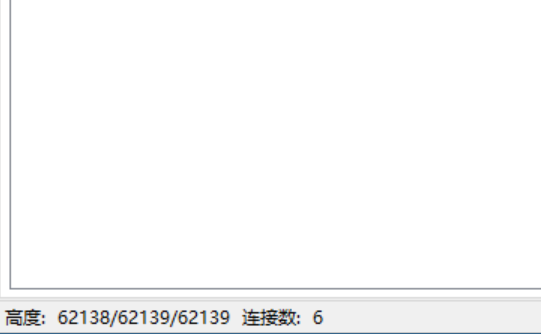

至此，我们已经成功搭建好私链并且用自己的节点连接上了。

> [!Note]
>
> 如果 NEO-GUI 连接数为 0，可以删除其根目录下的 "Chain_xx" 和 "Index_xx" 文件夹后再重新连接。

## 提取 NEO 和 GAS

在 NEO 网络的创世块中存放着 1 亿份 NEO，当私链搭建起来后，Gas 也将伴着新区块的生成而生成。下面我们将从多方签名合约中提取出这部分 NEO 和 GAS 以便开发测试使用。

### 创建多方签名地址

在 NEO-GUI 中依次打开四个钱包，进行以下操作：

1. 右键单击账户页面空白处，选择`创建合约地址` -> `多方签名`在每个钱包里添加多方签名地址。

2. 依次输入之前保存好的四个钱包的公钥，设置最小签名数量为 3（共识节点数量 / 2 + 1），点击 `确定`。

   

3. 点击 `钱包` -> `重建钱包索引`。

> [!Note]
>
> 四个钱包都要添加多方签名地址，否则签名会失败。

你将看到合约地址中出现了 1 亿 NEO，如图所示。

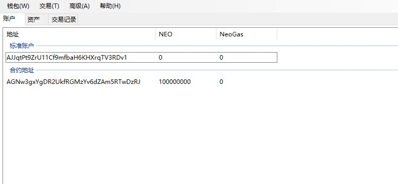

### 提取 NEO 到标准地址

进行如下操作，将 NEO 从合约地址转到标准地址中：

1. 打开四个钱包中的任意一个，点击 `交易`-> `转账`。

2. 输入要转入的标准地址，将 1 亿 NEO 转到这个地址中。

3. 系统会提示“交易构造完成，但没有足够的签名”，将代码复制下来。

4. 打开第二个钱包，点击 `交易` ->`签名` 。

5. 粘贴刚才复制的代码，点击 `签名`， 然后将生成的代码复制下来。

6. 打开第三个钱包，点击 `交易`-> `签名`，粘贴刚才复制的代码，点击 `签名`。

   这时窗口中显示 `广播` 按钮，代表交易已经签名完成，达到多方签名合约要求的最少签名数量，可以广播。

7. 点击 `广播` 完成转账交易。

   等待片刻后将看到 1 亿 NEO 成功转入了标准地址。

   

### 提取 GAS 到标准地址

打开要转入 GAS 的钱包账户，点击 `高级` -> `提取 NeoGas` -> `全部提取`。


接下来的操作与转账 NEO 类似，将没有足够签名的代码复制下来，依次打开第二个和第三个钱包，完成交易签名和广播。提取成功后如下图所示。


## 准备节点钱包文件

现在我们创建一个新的钱包文件 0.json，放在节点根目录下供发布智能合约时使用。

1. 在 NEO-GUI 中创建一个新的钱包文件 0.json，复制默认地址备用。
2. 打开前面提取了 NEO 和 GAS 的钱包，将钱包中全部的资产都转入钱包 0.json 中，等待交易确认。
3. 打开钱包文件 0.json，可以看到其中的资产。

> [!Note]
>
> 由于部署和调用智能合约都需要花费 GAS，而 GAS 是伴随着每个新区块的生成而产生的，初搭建的私链 GAS 数很少，所以这里先不要停止私链，以生成足够多的 GAS。

# 开发与部署 NEP-5 合约

我们已经学会了如何搭建私链和启动节点连接私链，下文将以使用 windows 10 和 C# 为例，带领开发者配置环境、编写、编译以及在私链上部署和调用 NEO 智能合约。

在本节我们将完成以下任务：

- 安装合约开发环境
- 创建一个 NEP-5 合约项目
- 编译合约
- 部署合约
- 调用合约
- 查看合约资产

## 安装开发环境

### 安装 Visual Studio 2017

下载 [Visual Studio 2017](https://www.visualstudio.com/products/visual-studio-community-vs) 并安装，注意安装时需要勾选 `.NET Core 跨平台开发` 。

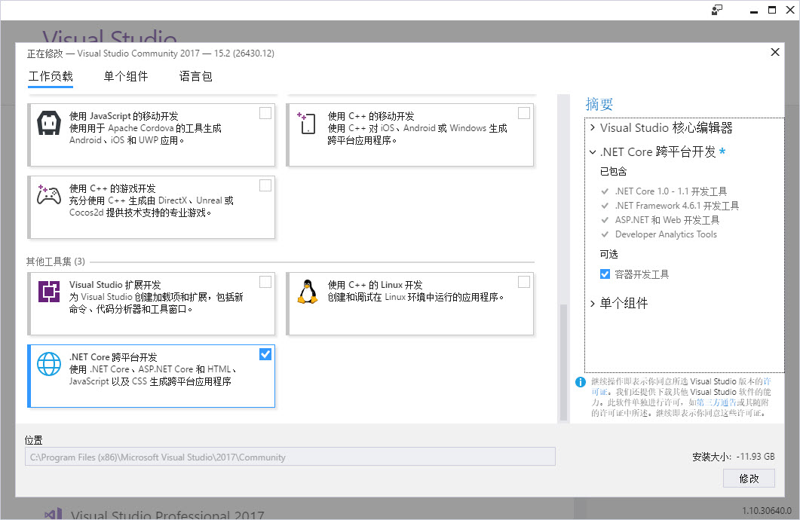

### 安装 NeoContractPlugin 插件

打开 Visual Studio 2017，点击 `工具` -> `扩展和更新` ，在左侧点击 `联机` ，搜索 Neo，安装 NeoContractPlugin 插件（该过程需要联网）。


### 配置 neo-compiler

1. 在 Github 上下载 [neo-compiler](https://github.com/neo-project/neo-compiler) 项目到本地。

2. 在 Visual Studio 2017 上点击 `文件` -> `打开` -> `项目/解决方案`，选择项目文件中的 neo-compiler.sln

3. 右键单击列表中的 neon 项目，点击 `发布`。

   

4. 配置好发布路径后，点击 `发布`。

   发布成功后，会在 bin\Release\PublishOutput 目录下生成 neon.exe 文件。

   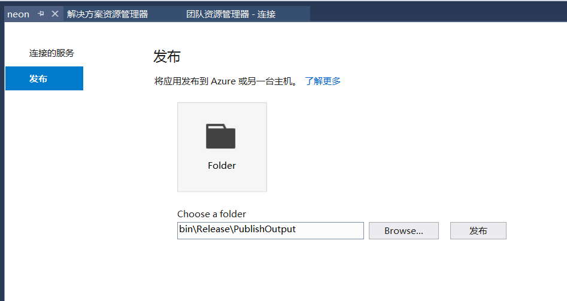

> [!Note]
>
> 发布过程中如果遇到如下错误提示：*无法复制文件”obj\Release\netcoreapp1.0\win10-x64\neon.dll“，原因是找不到该文件？*这可能是 VS 2017 （如 15.4，15.5）的一个 Bug，此时需要手动将 `\obj\Release\netcoreapp1.0\neon.dll` 文件复制到 `\obj\Release\netcoreapp1.0\win10-x64\` 文件夹中，然后重新发布即可。

### 设置环境变量

接下来需要添加 path，让任何位置都能访问 neon.exe。方法如下：

1. 在 Windows10 上 按 Windows + S 键，输入环境变量，选择 `编辑账户的环境变量` 

   

2. 选择 Path, 点击 `编辑`:

   

3. 在弹出来的窗口中点击 `新建` 并输入你自己的 neon.exe 所在的文件夹目录，点击 `确定` 。

> [!Note]
>
> 在环境变量中不要添加 “…… neon.exe” 字样的路径，要填写 neon.exe **所在的文件夹目录** 而非 neon.exe 本身的路径。

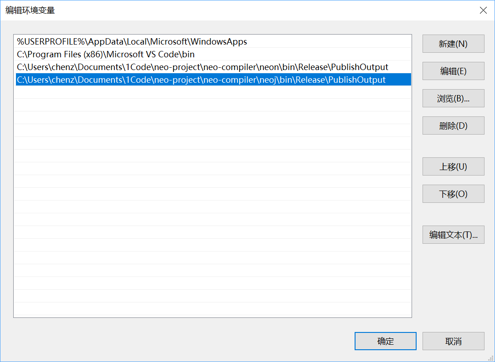

添加完 path 后，运行 CMD 或者 PowerShell 测试一下（如果添加 path 前就已经启动了 CMD 则要关掉重启），输入 neon 后，没有报错，如图所示输出版本号的提示信息即表示环境变量配置成功。

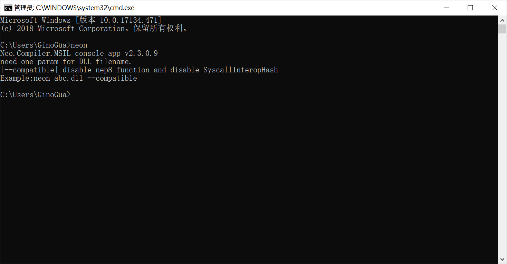

## 创建 NEO 合约项目

完成以上步骤后，即可在 Visual Studio 2017 中创建 NEO 智能合约项目（.NET Framework 版本任意）：

1. 点击 `文件` -> `新建` -> `项目`。
2. 在列表中选择 `NeoContract` 并进行必要设置后，点击 `确定`。


创建项目后，会自动生成一个 C# 文件，默认的类继承于 SmartContract，如图，此刻你已经拥有一个 Hello World 了！

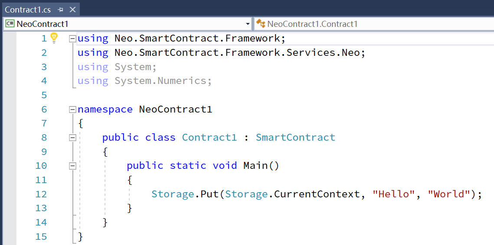

当然这只是一个简单的向私有化存储区中以 key-value 方式存储数据的操作。

## 编辑 NEP-5 代码

很多开发者比较关心的是如何在 NEO 公链上发布自己的合约资产，现在我们就在私链上一步步实现。

1. 从 [Github](https://github.com/neo-project/examples)上下载 NEP5 示例。

2. 在 Visual Studio 2017 中创建一个 NEO 智能合约项目，这里命名为 NEP5。

3. 打开示例文件 NEP5.cs

   代码中主要写了资产的基本信息和供调用的方法，你可以根据自己的需要增删或修改。

   > [!NOTE]
   >
   > 如果代码中有很多画红线的地方，提示找不到 Neo 命名空间，而且在项目的引用中有感叹号，可进行如下操作：
   >
   > 在 VS 中右击解决方案文件，点击 `管理 NuGet 程序包`，在新打开的页面中将 Neo.SmartContract.Framework 更新到最新稳定版。如果更新完之后依然存在红线，并且右侧 “引用” 中仍有个感叹号，可以尝试双击感叹号。如果仍然无法解决问题，可以尝试下面的办法：
   >
   > 1. 在 [这里](https://www.nuget.org/downloads) 下载 nuget.exe，然后将其复制到 NeoContract 项目的根目录。
   > 2. 打开 Power Shell 或命令提示符（CMD）。
   > 3. 转到 NeoContract 项目的根目录，运行 `nuget restore` 即可。

4. 这里我们对示例文件进行一些修改：

   - 设定资产总值和`deploy` 方法
   - 将 "Owner" 替换成钱包 0.json 中的地址 （否则将无法使用钱包中的资产）

   代码如下：

```c#
using Neo.SmartContract.Framework;
using Neo.SmartContract.Framework.Services.Neo;
using Neo.SmartContract.Framework.Services.System;
using System;
using System.ComponentModel;
using System.Numerics;

namespace NEP5
{
    public class NEP5 : SmartContract
    {
        [DisplayName("transfer")]
        public static event Action<byte[], byte[], BigInteger> Transferred;

        private static readonly byte[] Owner = "Ad1HKAATNmFT5buNgSxspbW68f4XVSssSw".ToScriptHash(); //Owner Address
        private static readonly BigInteger TotalSupplyValue = 10000000000000000;

        public static object Main(string method, object[] args)
        {
            if (Runtime.Trigger == TriggerType.Verification)
            {
                return Runtime.CheckWitness(Owner);
            }
            else if (Runtime.Trigger == TriggerType.Application)
            {
                var callscript = ExecutionEngine.CallingScriptHash;

                if (method == "balanceOf") return BalanceOf((byte[])args[0]);

                if (method == "decimals") return Decimals();

                if (method == "deploy") return Deploy();

                if (method == "name") return Name();

                if (method == "symbol") return Symbol();

                if (method == "supportedStandards") return SupportedStandards();

                if (method == "totalSupply") return TotalSupply();

                if (method == "transfer") return Transfer((byte[])args[0], (byte[])args[1], (BigInteger)args[2], callscript);
            }
            return false;
        }

        [DisplayName("balanceOf")]
        public static BigInteger BalanceOf(byte[] account)
        {
            if (account.Length != 20)
                throw new InvalidOperationException("The parameter account SHOULD be 20-byte addresses.");
            StorageMap asset = Storage.CurrentContext.CreateMap(nameof(asset));
            return asset.Get(account).AsBigInteger();
        }
        [DisplayName("decimals")]
        public static byte Decimals() => 8;

        private static bool IsPayable(byte[] to)
        {
            var c = Blockchain.GetContract(to);
            return c == null || c.IsPayable;
        }

        [DisplayName("deploy")]
        public static bool Deploy()
        {
            if (TotalSupply() != 0) return false;
            StorageMap contract = Storage.CurrentContext.CreateMap(nameof(contract));
            contract.Put("totalSupply", TotalSupplyValue);
            StorageMap asset = Storage.CurrentContext.CreateMap(nameof(asset));
            asset.Put(Owner, TotalSupplyValue);
            Transferred(null, Owner, TotalSupplyValue);
            return true;
        }

        [DisplayName("name")]
        public static string Name() => "GinoMo"; //name of the token

        [DisplayName("symbol")]
        public static string Symbol() => "GM"; //symbol of the token

        [DisplayName("supportedStandards")]
        public static string[] SupportedStandards() => new string[] { "NEP-5", "NEP-7", "NEP-10" };

        [DisplayName("totalSupply")]
        public static BigInteger TotalSupply()
        {
            StorageMap contract = Storage.CurrentContext.CreateMap(nameof(contract));
            return contract.Get("totalSupply").AsBigInteger();
        }
#if DEBUG
        [DisplayName("transfer")] //Only for ABI file
        public static bool Transfer(byte[] from, byte[] to, BigInteger amount) => true;
#endif
        //Methods of actual execution
        private static bool Transfer(byte[] from, byte[] to, BigInteger amount, byte[] callscript)
        {
            //Check parameters
            if (from.Length != 20 || to.Length != 20)
                throw new InvalidOperationException("The parameters from and to SHOULD be 20-byte addresses.");
            if (amount <= 0)
                throw new InvalidOperationException("The parameter amount MUST be greater than 0.");
            if (!IsPayable(to))
                return false;
            if (!Runtime.CheckWitness(from) && from.AsBigInteger() != callscript.AsBigInteger())
                return false;
            StorageMap asset = Storage.CurrentContext.CreateMap(nameof(asset));
            var fromAmount = asset.Get(from).AsBigInteger();
            if (fromAmount < amount)
                return false;
            if (from == to)
                return true;

            //Reduce payer balances
            if (fromAmount == amount)
                asset.Delete(from);
            else
                asset.Put(from, fromAmount - amount);

            //Increase the payee balance
            var toAmount = asset.Get(to).AsBigInteger();
            asset.Put(to, toAmount + amount);

            Transferred(from, to, amount);
            return true;
        }
    }
}

```

编辑完之后，我们已经完成了一份智能合约的代码部分。

## 编译合约文件

点击菜单栏上的 `生成`->`生成解决方案`（快捷键 Ctrl + Shift + B）开始编译程序。

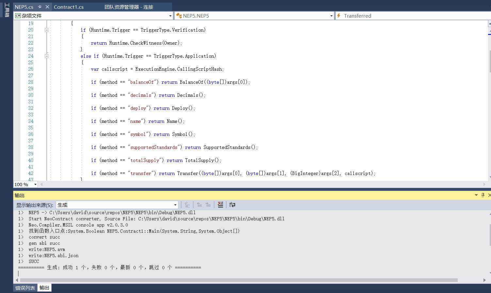

编译成功后你会在该项目的 `bin/Debug` 目录下看到生成的 `NEP5.avm` 文件，该文件即是生成的 NEO 智能合约文件。


`NEP5.abi.json` 是智能合约的描述文档，文档中对合约的 ScriptHash、入口、方法、参数、返回值等进行了描述。关于更多智能合约 ABI 的信息，可以参考 [NeoContract ABI](https://github.com/neo-project/proposals/blob/master/nep-3.mediawiki)。

> [!Note]
>
> 由于 neon 默认使用 nep-8 的模式编译 dll，与 nep5 不兼容，所以我们需要以 nep5 的方式进行 avm 的执行。
>
> 打开Power Shell 或命令提示符（CMD），进入 bin/Debug 目录，输入如下命令（将nep5.dll替换成你自己的项目文件）：
>
> `neon nep5.dll --compatible`
>
> 生成的 `nep5.avm` 文件和`nep5.abi.json` 文件将会覆盖之前的对应文件。

## 部署合约

生成合约文件后，我们可以使用 NEO-GUI 进行部署。

1. 打开钱包文件 0.json，点击 `高级` -> `部署合约`。

2. 在部署合约对话框中，点击 `加载` 选择编译好的合约文件。

   此时代码框下方会显示合约脚本散列，将其复制供调用合约时使用。

3. 填写信息与元数据区域的参数。每个参数都需要填写，否则无法激活 `部署` 按钮。

   对于NEP-5资产合约，参数列表填 0710，返回值填 05。

   具体填写规则可参考 [智能合约参数和返回值](http://docs.neo.org/zh-cn/sc/Parameter.html)。

   勾选 `需要创建存储区`，NEP5 标准使用存储区来维护帐户，因此需要勾选此项。

    `需要动态调用`和 `Payable`暂时无需勾选。

4. 完成所有参数填写后，点击 `部署`。

5. 在弹出的调用合约窗口中点击 `试运行`，确认无误，点击 `调用`。

   部署合约需要花费100 ~1000 GAS，详情请参见 [系统手续费](http://docs.neo.org/zh-cn/sc/systemfees.html)。

部署成功后，你的智能合约已经发布到区块链上了。

## 调用合约

现在调用上一步发布的智能合约。

1. 点击 `高级` -> `调用合约` -> `函数调用`。

2. 将之前复制好的合约脚本填入 `ScriptHash`，再按搜索键，该合约相关信息会自动显示出来。

3. 点击 `参数列表` 旁的 `...` 进入编辑窗口。

   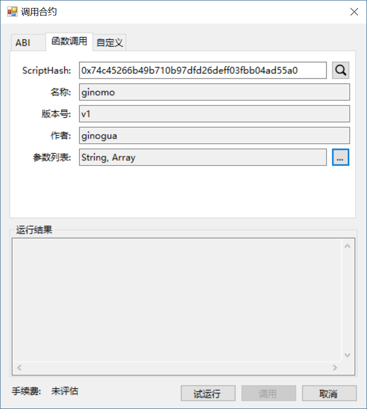

4. 对应你写的智能合约，[0] 是该函数名，[1] 是该函数的输入参数，如果没有可忽略。我们现在要调用 deploy 函数发布该资产到链上，则点击 [0]，在新值中填写 “deploy”，注意一定要小写，然后点击`更新`，关掉当前窗口。

   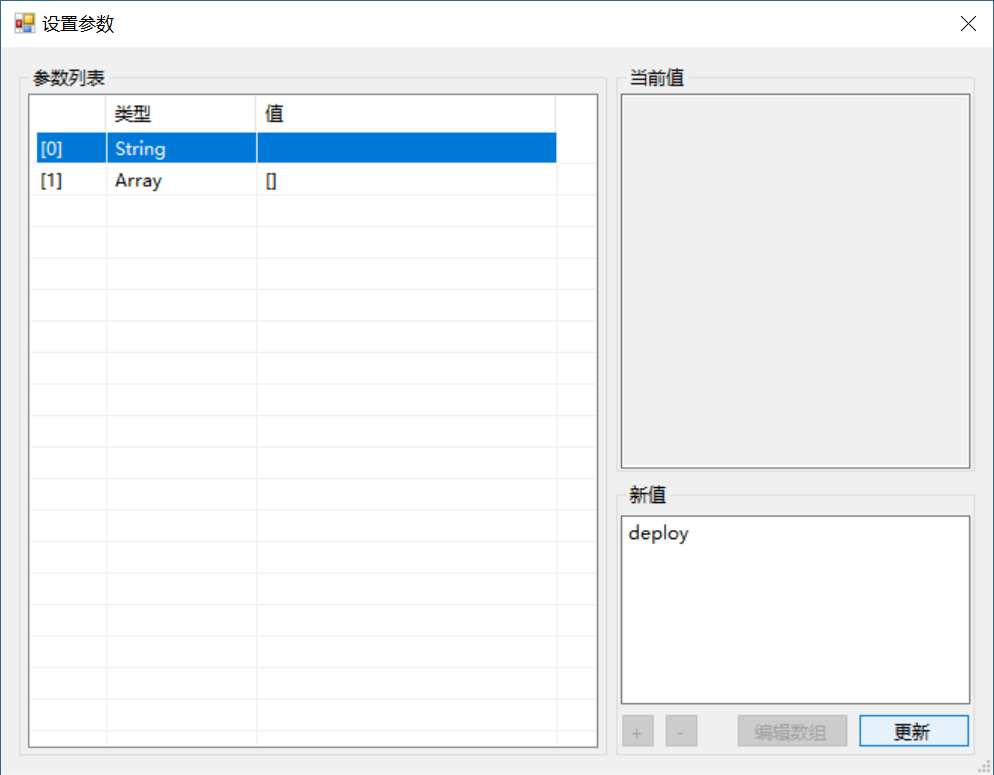

5. 点击 `试运行`，可以测试该合约。确认无误，点击 `调用`，调用合约也需要消耗少量的 GAS 。

## 查看合约资产

在 NEO-GUI 中点击 `高级`-> `选项`，添加刚部署的资产的脚本散列，即可在资产页面看到你的 NEP-5 资产。

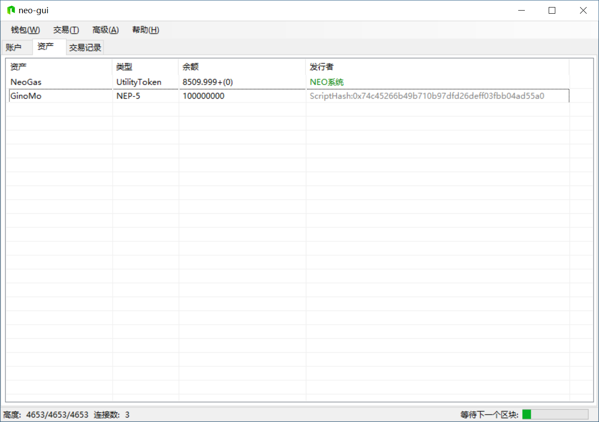

至此，祝贺你已经成功地在NEO 私链上发布了智能合约。
